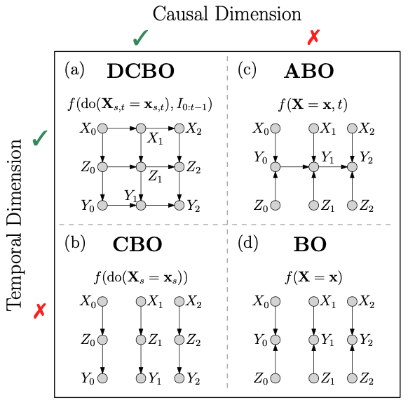
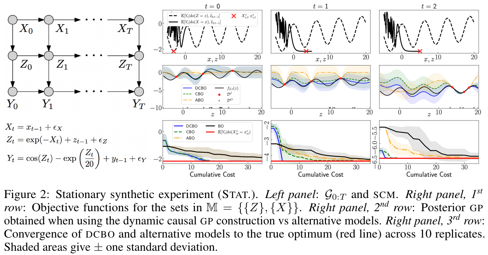

# Dynamic Causal Bayesian Optimization

This is a Python implementation of [Dynamic Causal Bayesian Optimization](https://proceedings.neurips.cc/paper/2021/file/577bcc914f9e55d5e4e4f82f9f00e7d4-Paper.pdf) as presented at NeurIPS 2021.

## Abstract

This paper studies the problem of performing a sequence of optimal interventions in a causal dynamical system where both the target variable of interest and the inputs evolve over time. This problem arises in a variety of domains e.g. system biology and operational research. Dynamic Causal Bayesian Optimization (DCBO) brings together ideas from sequential decision making, causal inference, and Gaussian process (GP) emulation. DCBO is useful in scenarios where all causal effects in a graph are changing over time. At every time step DCBO identifies a local optimal intervention by integrating both observational and past interventional data collected from the system. We give theoretical results detailing how one can transfer interventional information across time steps and define a dynamic causal GP model which can be used to quantify uncertainty and find optimal interventions in practice. We demonstrate how DCBO identifies optimal interventions faster than competing approaches in multiple settings and applications.

<p align="center" width="100%">
    
</p>

### Authors

[Virginia Aglietti](https://uk.linkedin.com/in/virginia-aglietti-a80321a4), [Neil Dhir](https://neildhir.github.io/), [Javier Gonzalez](https://javiergonzalezh.github.io/) and [Theodoros Damoulas](https://warwick.ac.uk/fac/sci/statistics/staff/academic-research/damoulas/)

### Demonstration

<p align="center" width="100%">
    
</p>

## Installation

Ensure you have Python 3.7 or later installed. Then, install the required dependencies, including TensorFlow and TensorFlow Probability:

```bash
pip install -e .
